####1.创建Scala工程

   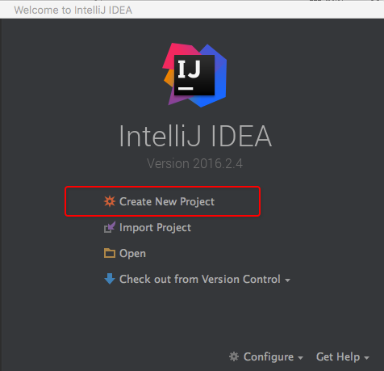  
   选择[Create New Porject]
   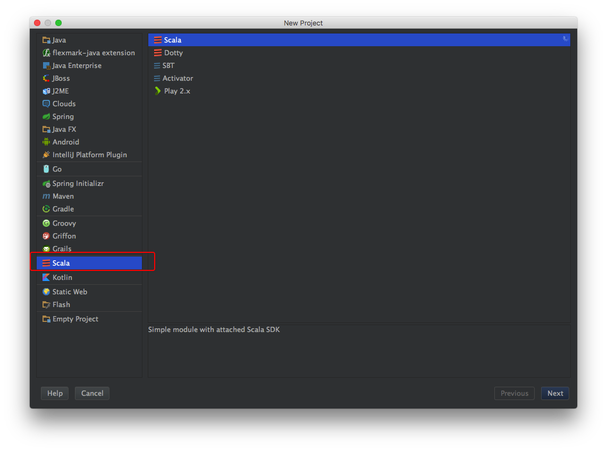  
   选择,创建[scala]项目,选择【next】
   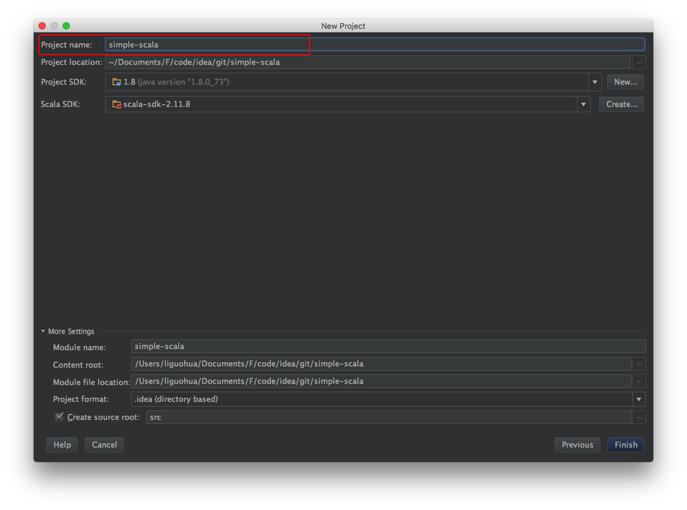   
   输入项目名称，选择【finish】进入下面的窗口。
   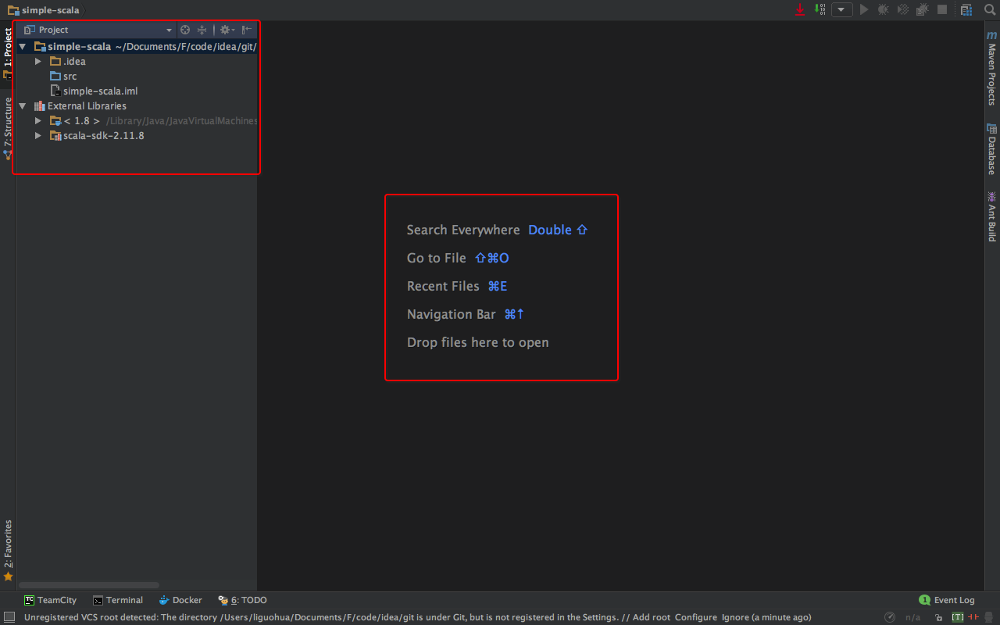  
   左侧是工程结构，中间是快捷键提示！      
####2.创建Scala包
   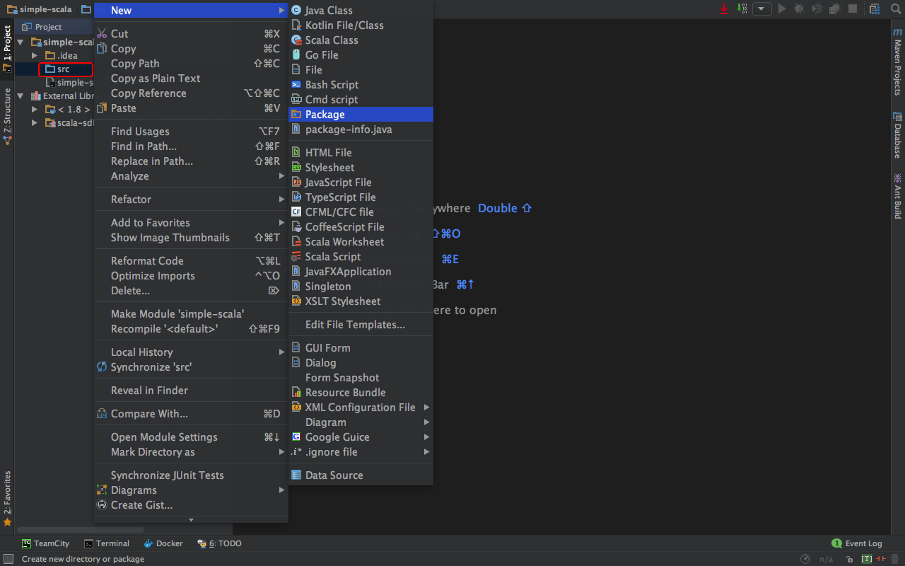
   输入包名，选择【OK】
   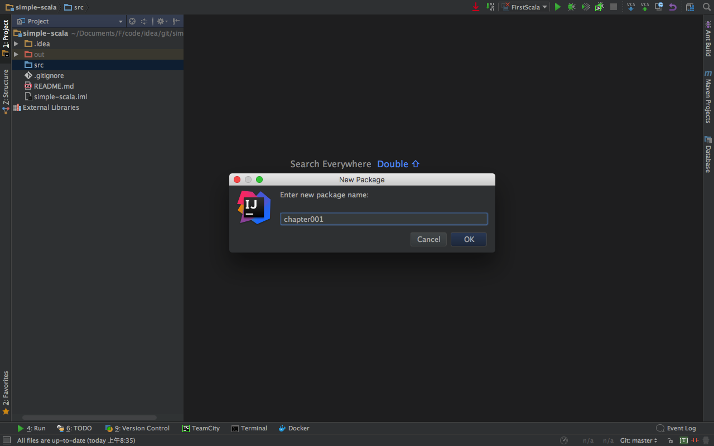
   包创建完毕！
   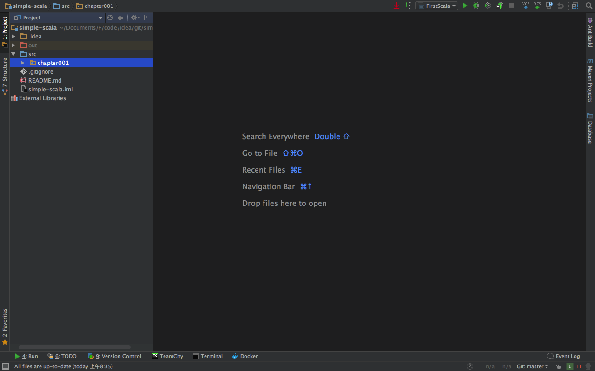
####3.创建Scala对象
   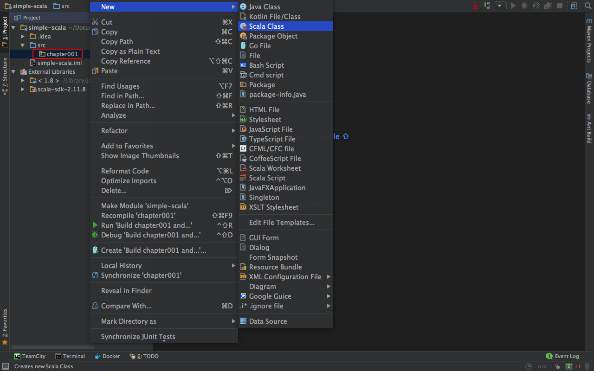 
   在弹出的窗口中选择【Kind的类型为Object】
   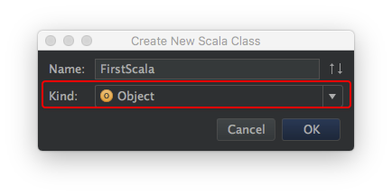
   进入主界面，主界面中的代码是自动生成的。
   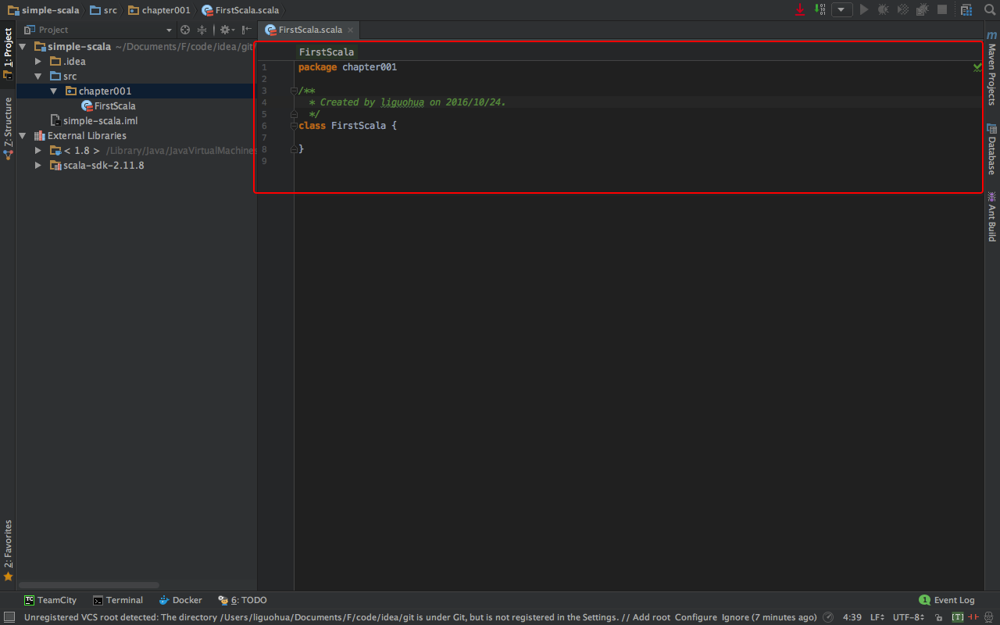 
####4.创建Scala代码
   A.编写代码  
   根据编程语言的惯例，先编写一个helloworld的简单代码。
   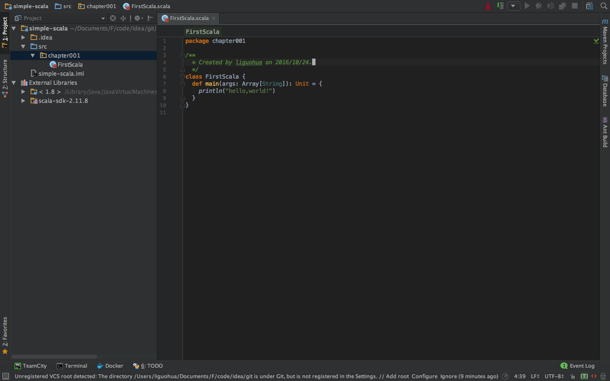   
   代码清单，如下
```scala
package chapter001
object FirstScala {
  def main(args: Array[String]): Unit = {
    println("hello,world!")
  }
}
```
   B.运行代码  
   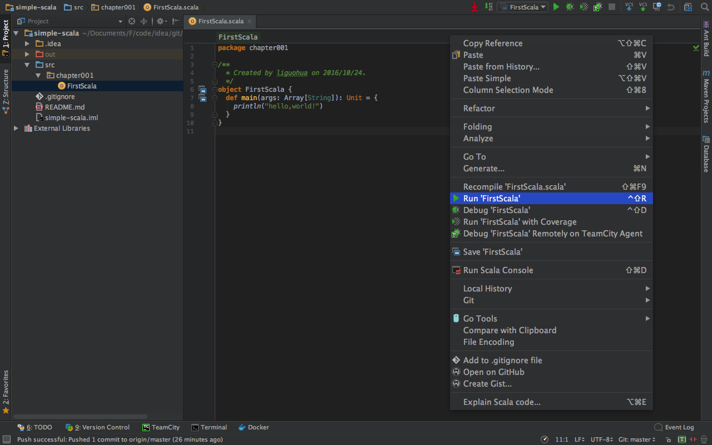 
   选择【Run 'FirstScala'】,运行效果图，如下
   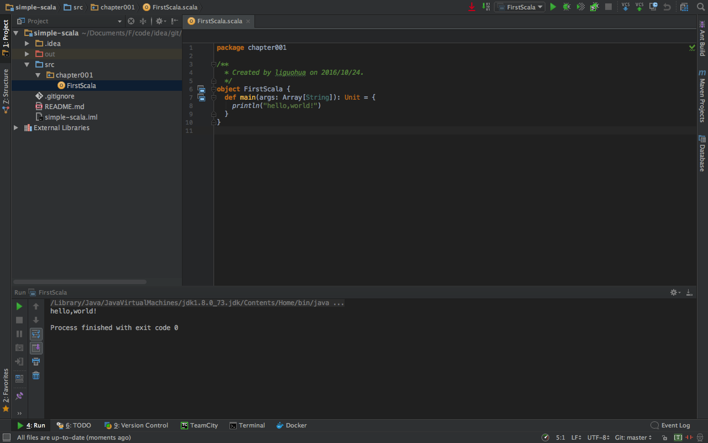 
   C.程序解释
 ```scala
 //指定package,不用";"结尾
 package chapter001
 //创建名为FirstScala的object
 object FirstScala {
   //创建main方法，作为程序的入口。
   //def main(args: Array[String]): Uni= 是方法头。{}中的内容为方法体。
   //方法头中：def是关键字，main是方法名，(args: Array[String])是参数列表, Unit是返回值类型，
   //':'用于分割方法签名和返回值，'='用于分隔方法头和方体。
   def main(args: Array[String]): Unit = {
     //打印语句，用于输出"hello,world!"
     println("hello,world!")//语句不必用";"结尾
   }
 }
 ``` 