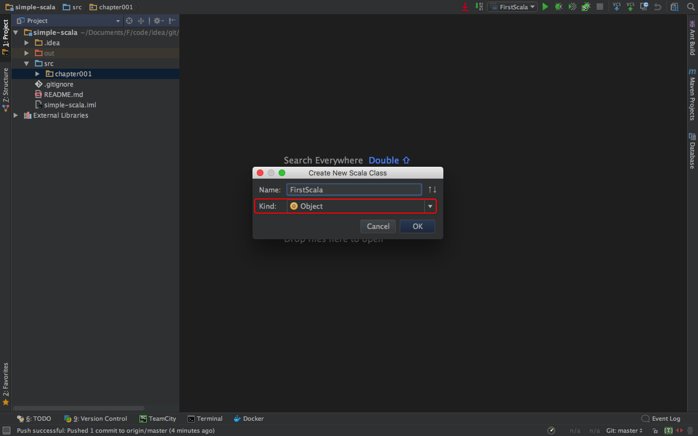
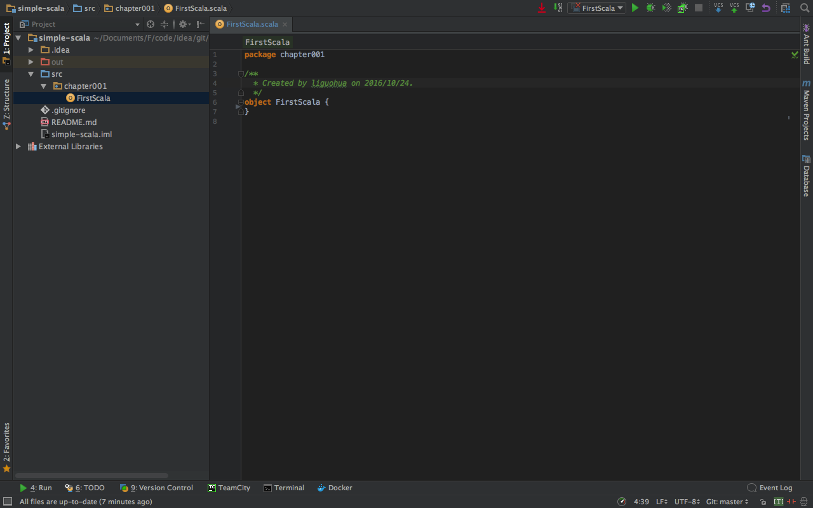

####1.创建Scala工程
    
   选择[Create New Porject]
    
   选择,创建[scala]项目
    
   输入项目名称，选择【finish】进入下面的窗口。
   
   左侧是工程结构，中间是快捷键提示！
    
####2.创建Scala包
    
####3.创建Scala对象
    
   在弹出的窗口中选择【Kind的类型为Object】
   
   进入主界面，主界面中的代码是自动生成的。
    
####4.创建Scala代码
   A.编写代码
        根据编程语言的惯例，先编写一个helloworld的简单代码。
    
   
```scala
package chapter001
object FirstScala {
  def main(args: Array[String]): Unit = {
    println("hello,world!")
  }
}
```

   B.运行代码
        运行效果图，如下
    
  