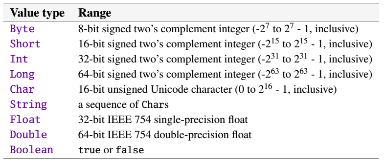

##一.Scala的数值类型
任何一门计算机语言，都有其自己的类型系统。一般都会支持最常用最基本的数据类型，在Scala中最常用最基本的数据类型就是值类型，下图是Scala语言所支持值类型。  
  
说明：
1.数值类型
2.非数值类型
```
 a.''numeric value types'':有[[scala.Double]], [[scala.Float]], [[scala.Long]], [[scala.Int]], [[scala.Char]],[[scala.Short]], [[scala.Byte]] 七种。
 b.''non-numeric value types''有[[scala.Unit]] and [[scala.Boolean]] 两种。
```


##一.Int类型
Int类型是现实生活中最长见的类型之一。  
比如：全班有70名同学，20名男同学，50名女同学。这里的70，20，50都是整数。  
再比如：一篮子水果，有5个香蕉，3个梨，7个苹果，2个菠萝。这里的5，3，7，2也都是整数。
在日常生活中我们通常使用的是'逢十进一'的十进制，但在Scala中，整数常用的有四种进制表达形式，分别是十进制，八进制，和十六进制

```scala
scala> 0x31
res1: Int = 49
```


```scala
scala> 98
res2: Int = 98

```

```scala

```

```scala

```
Scala的


