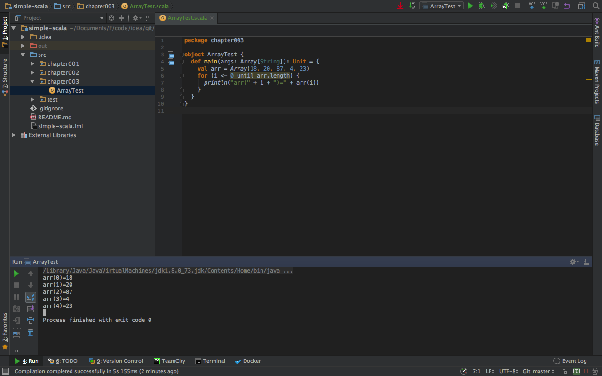
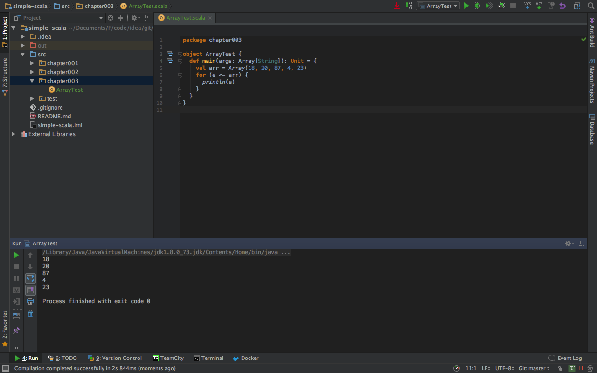
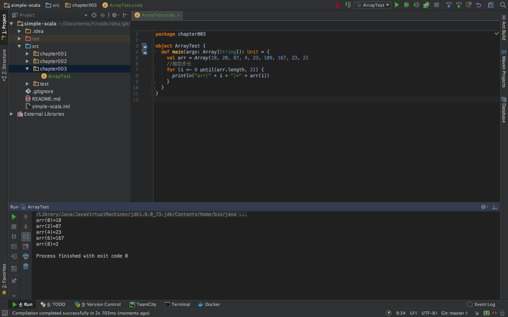
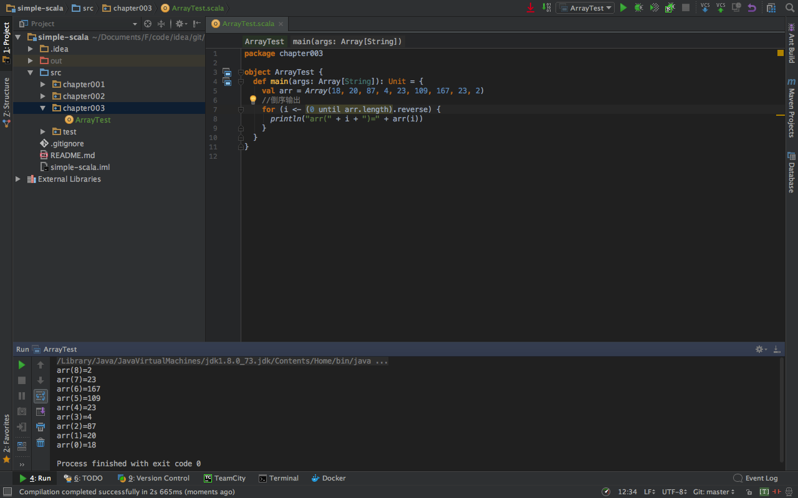
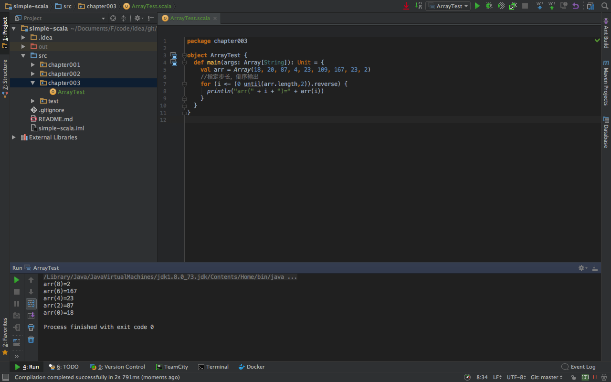

###一、数组的定义

1.创建长度为10的int类型数组
```scala
scala>var arr:Array[Int]=new Array[Int](10)
arr: Array[Int] = Array(0, 0, 0, 0, 0, 0, 0, 0, 0, 0)
```

2.数组的类型可以自动推断
```scala
scala>  var arr=new Array[Int](10)
arr: Array[Int] = Array(0, 0, 0, 0, 0, 0, 0, 0, 0, 0)
```

3.如果数组元素的类型是ValAny,那么数组元素的默认值是0,0.0,false  
```scala
scala> val arr=new Array[Int](5)
arr: Array[Int] = Array(0, 0, 0, 0, 0)

scala> val arr=new Array[Float](5)
arr: Array[Float] = Array(0.0, 0.0, 0.0, 0.0, 0.0)

scala> val arr=new Array[Boolean](5)
arr: Array[Boolean] = Array(false, false, false, false, false)
```


4.如果数组元素的类型是RefAny,那么数组元素的默认值是null
```scala
scala> val arr=new Array[String](5)
arr: Array[String] = Array(null, null, null, null, null)
```

5.调用数组的apply()方法也可以定义数组，元素类型和数组长度都可以推断
```scala
scala> val arr=Array(18,20,87,4,23)
arr: Array[Int] = Array(18, 20, 87, 4, 23)

scala> arr.length
res1: Int = 5
```

###二、数组的元素
1.获取数组中指定下标的元素
```scala
scala> val arr=Array(18,20,87,4,23)
arr: Array[Int] = Array(18, 20, 87, 4, 23)

scala> arr(0)
res2: Int = 18
```

2.更改数组中指定下标的元素
```scala
scala> val arr=Array(18,20,87,4,23)
arr: Array[Int] = Array(18, 20, 87, 4, 23)

scala> arr(1)=1024

scala> arr
res4: Array[Int] = Array(18, 1024, 87, 4, 23)
```
###三、数组的遍历
1.数组的to遍历
 
代码如下：
```scala
package chapter003
object ArrayTest {
  def main(args: Array[String]): Unit = {
    val arr = Array(18, 20, 87, 4, 23)
    for (i <- 0 to arr.length - 1) {
      println("arr(" + i + ")=" + arr(i))
    }
  }
}
```

2.数组的until遍历
 
代码如下：
```scala
package chapter003
object ArrayTest {
  def main(args: Array[String]): Unit = {
    val arr = Array(18, 20, 87, 4, 23)
    for (i <- 0 until arr.length) {
      println("arr(" + i + ")=" + arr(i))
    }
  }
}

```

3.直接对元素进行遍历
 
代码如下：
```scala
package chapter003
object ArrayTest {
  def main(args: Array[String]): Unit = {
    val arr = Array(18, 20, 87, 4, 23)
    for (e <- arr) {
      println(e)
    }
  }
}
```

4.指定步长进行遍历
 
代码如下：
```scala
package chapter003

object ArrayTest {
  def main(args: Array[String]): Unit = {
    val arr = Array(18, 20, 87, 4, 23, 109, 167, 23, 2)
    //指定步长
    for (i <- 0 until(arr.length, 2)) {
      println("arr(" + i + ")=" + arr(i))
    }
  }
}
```

5.倒序遍历数组
 
代码如下：
```scala
package chapter003

object ArrayTest {
  def main(args: Array[String]): Unit = {
    val arr = Array(18, 20, 87, 4, 23, 109, 167, 23, 2)
    //倒序输出
    for (i <- (0 until arr.length).reverse) {
      println("arr(" + i + ")=" + arr(i))
    }
  }
}
```

6.指定步长，倒序遍历数组
 
代码如下：
```scala
package chapter003

object ArrayTest {
  def main(args: Array[String]): Unit = {
    val arr = Array(18, 20, 87, 4, 23, 109, 167, 23, 2)
    //指定步长，倒序输出
    for (i <- (0 until(arr.length,2)).reverse) {
      println("arr(" + i + ")=" + arr(i))
    }
  }
}
```


```scala

```


```scala

```


```scala

```


```scala

```


```scala

```


```scala

```


```scala

```


```scala

```


```scala

```


```scala

```


```scala

```


```scala

```


