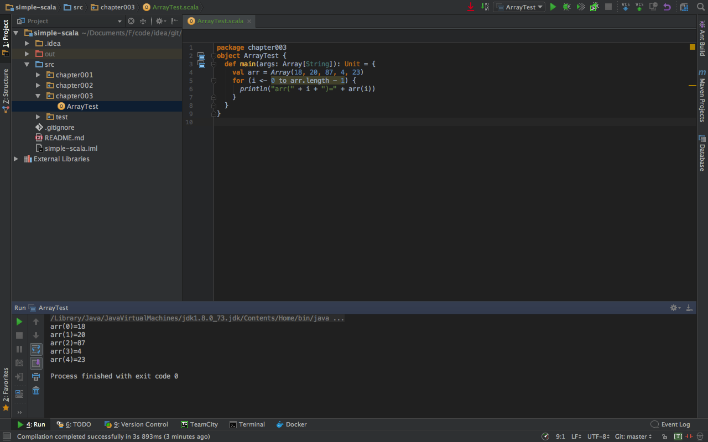

##一.Scala的Array

创建长度为10的int类型数组
```scala
scala>     var arr:Array[Int]=new Array[Int](10)
arr: Array[Int] = Array(0, 0, 0, 0, 0, 0, 0, 0, 0, 0)
```

数组的类型可以自动推断
```scala
scala>  var arr=new Array[Int](10)
arr: Array[Int] = Array(0, 0, 0, 0, 0, 0, 0, 0, 0, 0)
```


```scala
scala> val arr=new Array[Int](10)
arr: Array[Int] = Array(0, 0, 0, 0, 0, 0, 0, 0, 0, 0)
```


如果数组元素的类型是ValAny,那么数组元素的默认值是0,0.0,false
```scala
scala> val arr=new Array[Int](5)
arr: Array[Int] = Array(0, 0, 0, 0, 0)

scala> val arr=new Array[Float](5)
arr: Array[Float] = Array(0.0, 0.0, 0.0, 0.0, 0.0)

scala> val arr=new Array[Boolean](5)
arr: Array[Boolean] = Array(false, false, false, false, false)
```


如果数组元素的类型是RefAny,那么数组元素的默认值是null
```scala
scala> val arr=new Array[String](10)
arr: Array[String] = Array(null, null, null, null, null, null, null, null, null, null)
```


调用数组的apply()方法也可以定义数组，元素类型和数组长度都可以推断
```scala
scala> val arr=Array(18,20,87,4,23)
arr: Array[Int] = Array(18, 20, 87, 4, 23)

scala> arr.length
res1: Int = 5
```


获取数组中指定下标的元素
```scala
scala> val arr=Array(18,20,87,4,23)
arr: Array[Int] = Array(18, 20, 87, 4, 23)

scala> arr(0)
res2: Int = 18
```

更改数组中指定下标的元素
```scala
scala> val arr=Array(18,20,87,4,23)
arr: Array[Int] = Array(18, 20, 87, 4, 23)

scala> arr(1)=1024

scala> arr
res4: Array[Int] = Array(18, 1024, 87, 4, 23)
```

数组遍历一
 
代码如下：
```scala
package chapter003
object ArrayTest {
  def main(args: Array[String]): Unit = {
    val arr = Array(18, 20, 87, 4, 23)
    for (i <- 0 to arr.length - 1) {
      println("arr(" + i + ")=" + arr(i))
    }
  }
}
```


```scala

```


```scala

```


```scala

```


```scala

```


```scala

```


```scala

```


```scala

```


```scala

```


```scala

```


```scala

```


```scala

```


```scala

```


```scala

```


```scala

```


```scala

```


```scala

```


```scala

```


