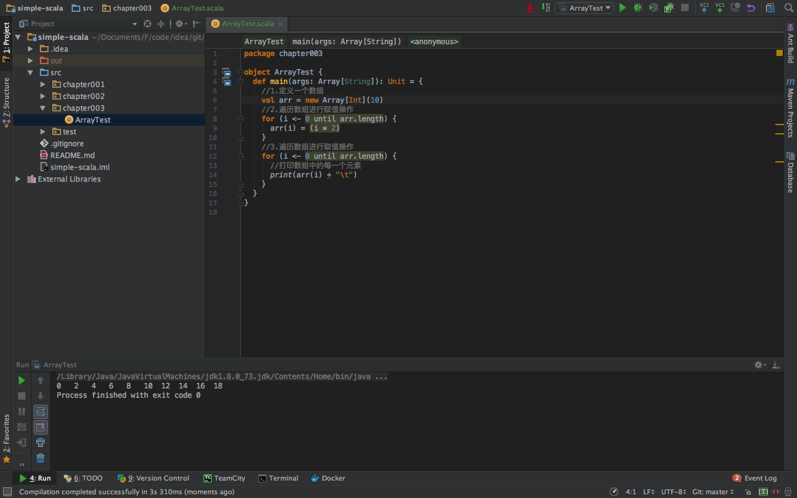
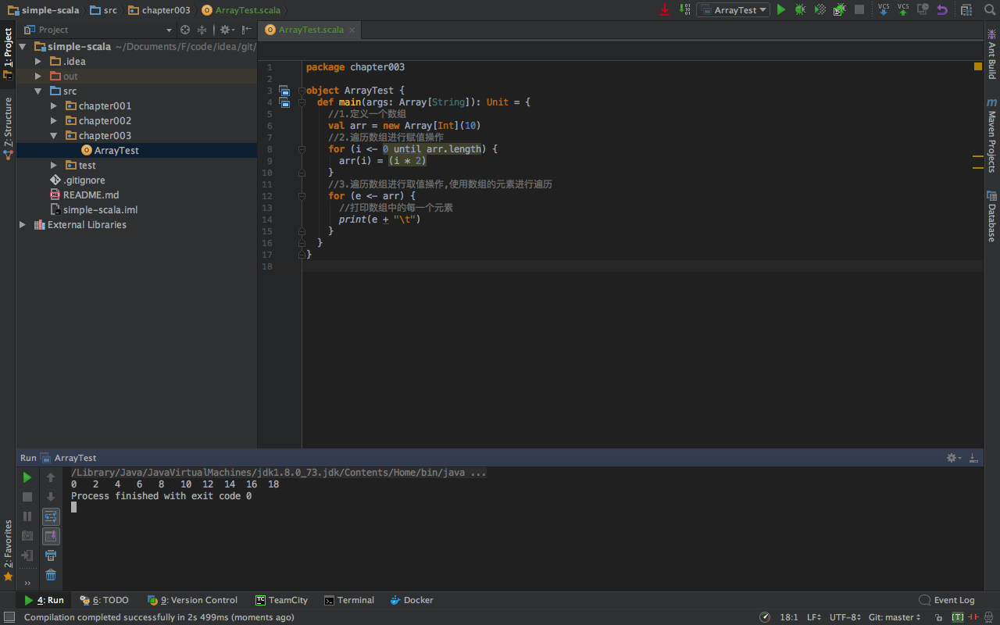

###一、数组的定义

1.创建长度为10的int类型数组
```scala
scala>var arr:Array[Int]=new Array[Int](10)
arr: Array[Int] = Array(0, 0, 0, 0, 0, 0, 0, 0, 0, 0)
```

2.数组的类型可以自动推断
```scala
scala>  var arr=new Array[Int](10)
arr: Array[Int] = Array(0, 0, 0, 0, 0, 0, 0, 0, 0, 0)
```

3.如果数组元素的类型是ValAny,那么数组元素的默认值是0,0.0,false  
```scala
scala> val arr=new Array[Int](5)
arr: Array[Int] = Array(0, 0, 0, 0, 0)

scala> val arr=new Array[Float](5)
arr: Array[Float] = Array(0.0, 0.0, 0.0, 0.0, 0.0)

scala> val arr=new Array[Boolean](5)
arr: Array[Boolean] = Array(false, false, false, false, false)
```


4.如果数组元素的类型是RefAny,那么数组元素的默认值是null
```scala
scala> val arr=new Array[String](5)
arr: Array[String] = Array(null, null, null, null, null)
```

5.调用数组的apply()方法也可以定义数组，元素类型和数组长度都可以推断
```scala
scala> val arr=Array(18,20,87,4,23)
arr: Array[Int] = Array(18, 20, 87, 4, 23)

scala> arr.length
res1: Int = 5
```

###三、数组的基本操作
数组是可以用下标标识的一组元素的集合。在这个集合上，一般可以执行增删改查的操作，和一些辅助增删改查的操作。
1.数组求和
```scala
scala> val arr = Array(3,5,8,9,4)
arr: Array[Int] = Array(3, 5, 8, 9, 4)

scala> arr.sum
res1: Int = 29
```

2.数组求最大值
```scala
scala> val arr = Array(3,5,8,9,4)
arr: Array[Int] = Array(3, 5, 8, 9, 4)

scala> arr.max
res2: Int = 9
```

3.数组求最小值
```scala
scala> val arr = Array(3,5,8,9,4)
arr: Array[Int] = Array(3, 5, 8, 9, 4)

scala> arr.min
res4: Int = 3
```

4.数组的toString()方法，返回数组的哈希地址
```scala
scala> val arr = Array(3,5,8,9,4)
arr: Array[Int] = Array(3, 5, 8, 9, 4)

scala> arr.toString()
res6: String = [I@19b02dfd
```

5.数组的toString()方法，返回数组的字符串表达形式
```scala
scala> val arr = Array(3,5,8,9,4)
arr: Array[Int] = Array(3, 5, 8, 9, 4)

scala> arr.mkString(",")
res7: String = 3,5,8,9,4

scala> arr.mkString("[",",","]")
res8: String = [3,5,8,9,4]

scala> arr.mkString("#","-","#")
res9: String = #3-5-8-9-4#
```

6.数组的克隆
```scala
scala> val arr1=Array(3,5,8,9,4)
arr1: Array[Int] = Array(3, 5, 8, 9, 4)

scala> val arr2=arr1.clone()
arr2: Array[Int] = Array(3, 5, 8, 9, 4)
```

7.数组的更新,更新指定下标中的元素
```scala
scala> val arr=Array("zhangsan","lisi","wangwu","zhaoliu")
arr: Array[String] = Array(zhangsan, lisi, wangwu, zhaoliu)

scala> arr.update(1,"lily")

scala> arr
res17: Array[String] = Array(zhangsan, lily, wangwu, zhaoliu)
```

8.数组是否包含指定的元素
```scala
val arr=Array("zhangsan","lisi","wangwu","zhaoliu")
arr: Array[String] = Array(zhangsan, lisi, wangwu, zhaoliu)

scala> arr.contains("zhangsan")
res22: Boolean = true
```

9.判断数组为空
```scala
scala> val arr=Array("zhangsan","lisi","wangwu","zhaoliu")
arr: Array[String] = Array(zhangsan, lisi, wangwu, zhaoliu)

scala> arr.isEmpty
res24: Boolean = false
```

10.判断数组不为空
```scala
scala> val arr=Array("zhangsan","lisi","wangwu","zhaoliu")
arr: Array[String] = Array(zhangsan, lisi, wangwu, zhaoliu)

scala> arr.nonEmpty
res25: Boolean = true
```

11.查看数组的类型
```scala
scala> val arr=Array("zhangsan","lisi","wangwu","zhaoliu")
arr: Array[String] = Array(zhangsan, lisi, wangwu, zhaoliu)

arr.getClass
res26: Class[_ <: Array[String]] = class [Ljava.lang.String;
```

12.数组的尾部追加单个元素，返回一个新的数组
```scala
scala> val arr1 = Array("zhangsan", "lisi", "wangwu", "zhaoliu")
arr1: Array[String] = Array(zhangsan, lisi, wangwu, zhaoliu)

//返回新的数组
scala> arr1:+"jack"
res36: Array[String] = Array(zhangsan, lisi, wangwu, zhaoliu, jack)

//原数组不变
scala> arr1
res41: Array[String] = Array(zhangsan, lisi, wangwu, zhaoliu)
```
13.数组的尾部追加数组元素，返回一个新的数组，':+'将整个数组添加到最后一个元素上。
```scala
scala> val arr1 = Array("zhangsan", "lisi", "wangwu", "zhaoliu")
arr1: Array[String] = Array(zhangsan, lisi, wangwu, zhaoliu)

scala> val arr2 = Array("jack", "lily")
arr2: Array[String] = Array(jack, lily)

//返回一个新的数组
scala> arr1:+arr2
res42: Array[java.io.Serializable] = Array(zhangsan, lisi, wangwu, zhaoliu, Array(jack, lily))

//原来数组不变
scala> arr1
res43: Array[String] = Array(zhangsan, lisi, wangwu, zhaoliu)
```

14.数组的尾部追加数组元素，返回一个新的数组,'++'将两个数组的合并成一个新的数组
```scala
scala> val arr1 = Array("zhangsan", "lisi", "wangwu", "zhaoliu")
arr1: Array[String] = Array(zhangsan, lisi, wangwu, zhaoliu)

scala> val arr2 = Array("jack", "lily")
arr2: Array[String] = Array(jack, lily)

//返回一个新的数组，两个数组元素的合并
scala> arr1++arr2
res44: Array[String] = Array(zhangsan, lisi, wangwu, zhaoliu, jack, lily)

//原来数组不变
scala> arr1
res45: Array[String] = Array(zhangsan, lisi, wangwu, zhaoliu)
```

15.数组排序，返回一个新的数组,原来数组不会发生任何改变，如果数组的元素是数字，默认从小到大排序。
```scala
scala> val arr=Array(3,5,8,9,4)
arr: Array[Int] = Array(3, 5, 8, 9, 4)

//返回一个新的数组
scala> arr.sorted
res1: Array[Int] = Array(3, 4, 5, 8, 9)

//原数组不变
scala> arr
res2: Array[Int] = Array(3, 5, 8, 9, 4)
```

16.数组排序，返回一个新的数组,原来数组不会发生任何改变，如果数组的元素是字符或字符串，默认按字母从小到大排序。
```scala
scala> val arr = Array("zhangsan", "lisi", "wangwu", "zhaoliu")
arr: Array[String] = Array(zhangsan, lisi, wangwu, zhaoliu)

scala> arr.sorted
res3: Array[String] = Array(lisi, wangwu, zhangsan, zhaoliu)

scala> arr
res4: Array[String] = Array(zhangsan, lisi, wangwu, zhaoliu)
```

17.数组的反转，返回一个新的数组,原来数组不会发生任何改变
```scala
scala> val arr=Array(3,5,8,9,4)
arr: Array[Int] = Array(3, 5, 8, 9, 4)

//返回一个新的数组//
scala> arr.reverse
res9: Array[Int] = Array(4, 9, 8, 5, 3)

//原数组不变
scala> arr
res10: Array[Int] = Array(3, 5, 8, 9, 4)
```

18.获取数组中指定下标的元素
```scala
scala> val arr=Array(18,20,87,4,23)
arr: Array[Int] = Array(18, 20, 87, 4, 23)

scala> arr(0)
res2: Int = 18
```

19.更改数组中指定下标的元素
```scala
scala> val arr=Array(18,20,87,4,23)
arr: Array[Int] = Array(18, 20, 87, 4, 23)

scala> arr(1)=1024

scala> arr
res4: Array[Int] = Array(18, 1024, 87, 4, 23)
```

###四、数组中常用的高阶函数
1.count()函数：对数组进行统计，统计不等于0的元素的个数
```scala
scala> val arr=Array(3,5,8,9,4)
arr: Array[Int] = Array(3, 5, 8, 9, 4)

scala> arr.count(_ != 0)
res28: Int = 5
```
2.map()函数：对数组进行的转化，原数组不变
```scala
scala> val arr=Array(3,5,8,9,4)
arr: Array[Int] = Array(3, 5, 8, 9, 4)

//数组的转化,返回新数组
scala> arr.map(_*2)
res29: Array[Int] = Array(6, 10, 16, 18, 8)
//原来数组不变
scala> arr
res30: Array[Int] = Array(3, 5, 8, 9, 4)
```
3.filter()函数：对数组的进行过滤，原数组不变
```scala
scala> val arr=Array(3,5,8,9,4)
arr: Array[Int] = Array(3, 5, 8, 9, 4)

//数组的过滤,返回新数组
scala> arr.filter(x=>(x%2)!=0)
res33: Array[Int] = Array(3, 5, 9)

//原来数组不变
scala> arr
res34: Array[Int] = Array(3, 5, 8, 9, 4)
```


###五、数组的遍历
1.数组的to遍历
 
代码如下：
```scala
package chapter003
object ArrayTest {
  def main(args: Array[String]): Unit = {
    val arr = Array(18, 20, 87, 4, 23)
    for (i <- 0 to arr.length - 1) {
      println("arr(" + i + ")=" + arr(i))
    }
  }
}
```

2.数组的until遍历
 
代码如下：
```scala
package chapter003
object ArrayTest {
  def main(args: Array[String]): Unit = {
    val arr = Array(18, 20, 87, 4, 23)
    for (i <- 0 until arr.length) {
      println("arr(" + i + ")=" + arr(i))
    }
  }
}

```

3.直接对元素进行遍历
 
代码如下：
```scala
package chapter003
object ArrayTest {
  def main(args: Array[String]): Unit = {
    val arr = Array(18, 20, 87, 4, 23)
    for (e <- arr) {
      println(e)
    }
  }
}
```

4.指定步长进行遍历
 
代码如下：
```scala
package chapter003

object ArrayTest {
  def main(args: Array[String]): Unit = {
    val arr = Array(18, 20, 87, 4, 23, 109, 167, 23, 2)
    //指定步长
    for (i <- 0 until(arr.length, 2)) {
      println("arr(" + i + ")=" + arr(i))
    }
  }
}
```

5.倒序遍历数组
 
代码如下：
```scala
package chapter003

object ArrayTest {
  def main(args: Array[String]): Unit = {
    val arr = Array(18, 20, 87, 4, 23, 109, 167, 23, 2)
    //倒序输出
    for (i <- (0 until arr.length).reverse) {
      println("arr(" + i + ")=" + arr(i))
    }
  }
}
```

6.指定步长，倒序遍历数组
 
代码如下：
```scala
package chapter003

object ArrayTest {
  def main(args: Array[String]): Unit = {
    val arr = Array(18, 20, 87, 4, 23, 109, 167, 23, 2)
    //指定步长，倒序输出
    for (i <- (0 until(arr.length,2)).reverse) {
      println("arr(" + i + ")=" + arr(i))
    }
  }
}
```
7.遍历数组的练习一，遍历数组，为数组赋值，并从数组中取值

 
代码如下：
```scala
package chapter003

object ArrayTest {
  def main(args: Array[String]): Unit = {
    //1.定义一个数组
    val arr = new Array[Int](10)
    //2.遍历数组进行赋值操作
    for (i <- 0 until arr.length) {
      arr(i) = (i * 2)
    }
    //3.遍历数组进行取值操作
    for (i <- 0 until arr.length) {
      //打印数组中的每一个元素
      print(arr(i) + "\t")
    }
  }
}
```
7.遍历数组的练习二，遍历数组，为数组赋值，并从数组中取值

 
代码如下：
```scala
package chapter003

object ArrayTest {
  def main(args: Array[String]): Unit = {
    //1.定义一个数组
    val arr = new Array[Int](10)
    //2.遍历数组进行赋值操作
    for (i <- 0 until arr.length) {
      arr(i) = (i * 2)
    }
    //3.遍历数组进行取值操作,使用数组的元素进行遍历
    for (e <- arr) {
      //打印数组中的每一个元素
      print(e + "\t")
    }
  }
}
```

###六、 scala.Array对象中的常用方法
0.引入scala.Array对象。因为以下操作都定义在scala.Array对象中，如果不引入此对象，操作都不能执行。
```scala
scala> import Array._
import Array._
```
1.concat():合并数组.会返回新的数组，原数组不变
```scala
//1.定义两个数组
scala> val arr1 = Array("zhangsan", "lisi", "wangwu", "zhaoliu")
arr1: Array[String] = Array(zhangsan, lisi, wangwu, zhaoliu)

scala> val arr2=Array("jack","lily")
arr2: Array[String] = Array(jack, lily)

//2.合并两个数组，返回新的数组
scala> var arr3 =  concat( arr1, arr2)
arr3: Array[String] = Array(zhangsan, lisi, wangwu, zhaoliu, jack, lily)

//3.查看原数组，原数组不变
scala> arr1
res11: Array[String] = Array(zhangsan, lisi, wangwu, zhaoliu)

scala> arr2
res12: Array[String] = Array(jack, lily)
```


```scala

```

```scala

```


```scala

```


```scala

```


```scala

```


```scala

```


```scala

```


```scala

```


```scala

```


```scala

```


```scala

```


```scala

```


```scala

```


